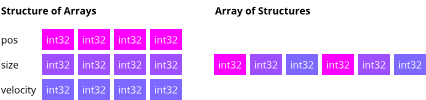

# SOA - Structure of Arrays

[](https://goreportcard.com/report/github.com/andygeiss/soa)

Allocate, Grow, Pack or Unpack Golang slices of basic types to optimize memory access for Data-Driven design.
The primary motivation is easier manipulation with packed SIMD instructions.



##### Table of Contents

- [Features](README.md#features)
- [Installation](README.md#installation)
- [Usage](README.md#usage)

## Freatures

* **Allocate** a new slice of a given basic type which uses one page of memory.
* **Grow** a slice of a given basic type to the next multiple of a page size.
* **Pack** all non-zero (0) values of a slice without changing the order.
* **Unpack** the values of a slice to the next multiple of a page.

## Installation

    go get -u github.com/andygeiss/soa

## Usage

The following function creates new entities with a position (p) and velocity (v),
which fits into one page size (ex. 4096 bytes on linux).

```go
func createEntities() (p, v []int32) {
    p = soa.DefaultManager.Allocate([]int32{}).([]int32)
    v = soa.DefaultManager.Allocate([]int32{}).([]int32)
    return
}
```

Next we want to ensure that we have enough space to add a new entity to the world, by using the following code. 

```go
func ensureSpace(offset, p, v) (pn []int32, vn []int32) {
    // no more space left for a new entity? then grow ... 
    if offset + 1 >= len(p) {
       pn = soa.DefaultManager.Grow(p)
       vn = soa.DefaultManager.grow(v)
    }
    return p, v
}
```

For serialization we dont need to save unused / initialized zero values.
Thus, we pack the slices.

```go
type World struct {
    p []int32
    v []int32
}

func saveWorld(w *World, filename string) (err error) {
    // open a new file
    file, err := os.OpenFile(filename, os.O_CREATE|os.O_TRUNC|os.O_WRONLY, 0644)
    if err != nil {
	return err
    }
    defer file.Close()
    // create packed world data
    var tmp World
    tmp.p = soa.DefaultManager.Pack(w.p).([]int32)
    tmp.v = soa.DefaultManager.Pack(w.v).([]int32)
    // encode data to JSON
    if err := json.NewEncoder(file).Encode(&tmp); err != nil {
	return err
    }
    return nil
}
```

Next time we load the world from the file and unpack the data:

```go
func loadWorld(filename string) (w *World, err error) {
    // open a new file
    file, err := os.Open(filename)
    if err != nil {
	return nil, err
    }
    defer file.Close()
    // decode data from JSON
    var tmp World
    if err := json.NewDecoder(file).Decode(&tmp); err != nil {
	return nil, err
    }
    tmp.p = soa.DefaultManager.Unpack(tmp.p).([]int32)
    tmp.v = soa.DefaultManager.Unpack(tmp.v).([]int32)
    return &tmp, nil
}
```
